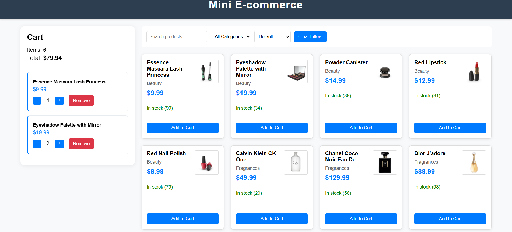

# Mini E-commerce Application

A simple e-commerce application built with React that allows users to browse products, filter and search items, and manage a shopping cart.



## Features

- Product listing with 20 items fetched from API
- Search products by name
- Filter products by category
- Sort products by price (low to high, high to low)
- Shopping cart with add, remove, and update quantity functionality
- Stock validation and quantity limits
- Responsive design

## Tech Stack

- React 18
- Vite
- CSS (vanilla)
- DummyJSON API

## Project Structure

```
ecomm/
├── src/
│   ├── components/
│   │   ├── Cart.jsx
│   │   ├── ProductCard.jsx
│   │   └── ProductList.jsx
│   ├── App.jsx
│   ├── index.css
│   └── main.jsx
├── assets/
│   ├── preview-pic.png
├── index.html
├── package.json
└── vite.config.js
```

## Installation and Setup

1. Clone the repository
```bash
git clone https://github.com/JatinPhogat/mini-ecommerce-better-way
cd mini-ecommerce-better-way
```

2. Install dependencies
```bash
npm install
```

3. Run the development server
```bash
npm run dev
```

4. Open your browser and navigate to `http://localhost:5173`
